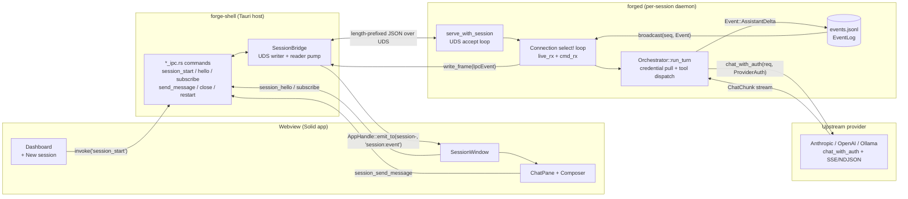
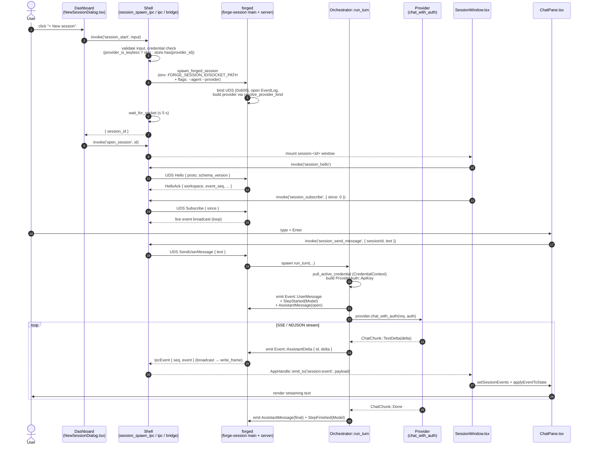
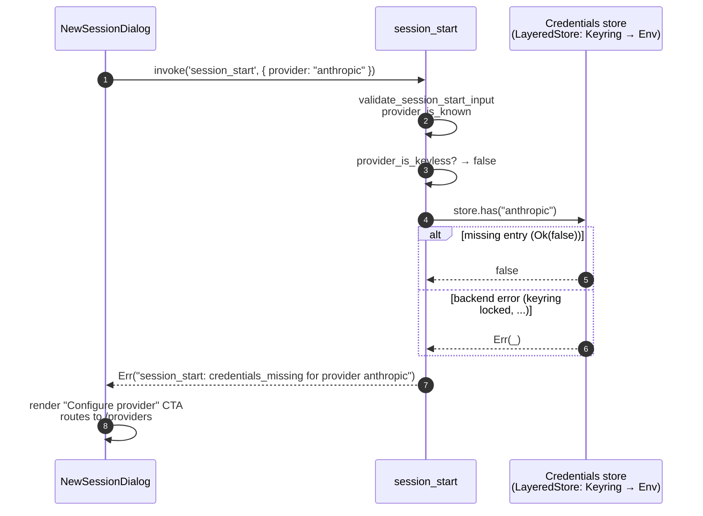

# Sessions End-to-End

**Status:** Reference (post-Phase 3.2)
**Audience:** New contributors who need to trace a single user message from the dashboard click through to a streamed assistant token, and operators debugging a misbehaving session.

This doc walks the canonical session lifecycle exactly as it is wired on `main` after Phase 3.2 (F-743 through F-750). It pins each step to a crate, file, and symbol so a reader can `cargo doc` or grep their way directly into the code.

For deeper background see [`overview.md`](overview.md) (tech stack), [`crate-architecture.md`](crate-architecture.md) (per-crate responsibilities), [`ipc-contracts.md`](ipc-contracts.md) (both IPC boundaries), and [`ADR-001-session-uds-protocol.md`](ADR-001-session-uds-protocol.md) (UDS wire contract). The error-path diagrams below reference the typed event variants defined in `crates/forge-core/src/event.rs`.

---

## 1. Component model

Forge is split across four process boundaries. The session lifecycle crosses three of them on every turn: webview → shell → `forged` daemon → upstream provider.



Trust boundaries:

- **Webview ↔ shell** — Tauri IPC. Every `#[tauri::command]` in `crates/forge-shell/src/` gates on the calling webview's window label (`require_window_label` in `ipc.rs`). Dashboard-only commands check `"dashboard"`; session commands check `"session-<id>"`. A webview cannot forge its label.
- **Shell ↔ daemon** — Unix domain socket at `$XDG_RUNTIME_DIR/forge/sessions/<id>.sock`, owner-only (0o600 file inside a 0o700 parent). Length-prefixed JSON frames; the contract is pinned in [`ADR-001`](ADR-001-session-uds-protocol.md). Mode enforcement lives in `crates/forge-session/src/server.rs::serve_with_session_swappable`.
- **Daemon ↔ provider** — outbound HTTPS. The per-turn credential is injected at the seam (`Provider::chat_with_auth`, F-744) and never persisted on the provider struct.

---

## 2. Happy-path sequence: composer click to streamed token



The whole pipeline is event-driven and asynchronous. Every event is written to `<workspace>/.forge/sessions/<id>/events.jsonl` (the `EventLog`) **before** it is broadcast — see [`ADR-001 §5`](ADR-001-session-uds-protocol.md) for the persist-before-broadcast invariant. A late-attaching client (a second shell window, the CLI `forge session tail`) replays from disk via `Subscribe { since: 0 }` and catches up to the live broadcast without missing events.

---

## 3. Code map

Each row pins a step from the sequence diagram to its concrete entry point. Symbols are stable as of commit `776859b` (F-748 merge).

| # | Step | Crate | File | Symbol | Notes |
|---|------|-------|------|--------|-------|
| 1 | Dashboard click | webview | `web/packages/app/src/components/dashboard/DashboardHero.tsx` | `+ New session` button | Opens `NewSessionDialog`. |
| 2 | New-session form submit | webview | `web/packages/app/src/components/NewSessionDialog.tsx` | `invoke<SessionStartOutput>('session_start', { input })` | Workspace path picked via Tauri dialog; provider id matches dashboard's `[providers]` shape. |
| 3 | `session_start` IPC | forge-shell | `crates/forge-shell/src/session_spawn_ipc.rs` | `session_start`, `validate_session_start_input`, `provider_is_known`, `check_provider_credential` | Dashboard-label gate, input validation, F-746 pre-spawn credential check. Errors prefixed `session_start: …`. |
| 4 | Keyless classifier | forge-shell | `crates/forge-shell/src/session_spawn_ipc.rs` | `provider_is_keyless` | Bare `"ollama"` and `custom_openai:<name>` with `auth = "none"` skip the credential probe. |
| 5 | Daemon spawn | forge-cli | `crates/forge-cli/src/spawn.rs` | `spawn_forged_session`, `spawn_forged_session_with_id`, `find_forged_binary`, `wait_for_socket` | Allocates a `SessionId`, composes socket + pid paths, forks `forged`, waits up to 5 s for the UDS to appear. |
| 6 | Daemon startup | forge-session | `crates/forge-session/src/main.rs` | `main` | Reads `FORGE_SESSION_ID`, `FORGE_SOCKET_PATH`, `FORGE_WORKSPACE`, `FORGE_PID_FILE`, `FORGE_ACTIVE_AGENT`. Refuses to start without `--provider` or `FORGE_PROVIDER` (F-743). |
| 7 | Provider grammar | forge-session | `crates/forge-session/src/provider_spec.rs` | `resolve_provider_kind`, `ProviderKind`, `parse_provider_spec` | Grammar: `<kind>[:<model>[@<base_url>]]`. Built-ins: `mock`, `ollama`, `anthropic`, `openai`. |
| 8 | Credential context build | forge-session | `crates/forge-session/src/main.rs` | `build_credential_context` | `LayeredStore::new(KeyringStore, EnvFallbackStore)` for keyed providers; `None` for Mock / Ollama. |
| 9 | UDS bind + accept | forge-session | `crates/forge-session/src/server.rs` | `serve_with_session`, `serve_with_session_swappable` | Chmod parent dir 0o700, socket 0o600 (F-044). |
| 10 | Event-log path | forge-session | `crates/forge-session/src/server.rs` | `event_log_path` | `<workspace>/.forge/sessions/<id>/events.jsonl`. |
| 11 | Session create / resume | forge-session | `crates/forge-session/src/session.rs` | `Session::create`, `Session::resume` | `resume` reuses the existing log on restart (F-748). |
| 12 | UDS handshake | forge-ipc | `crates/forge-ipc/src/lib.rs` | `IpcMessage::Hello`, `HelloAck`, `Subscribe`, `read_frame_with_deadline`, `write_frame`, `MAX_FRAME_SIZE` | 4 MiB frame cap; cap is enforced during serialization via `CapWriter`. |
| 13 | Shell-side connect | forge-shell | `crates/forge-shell/src/bridge.rs` | `SessionBridge::hello` | `UnixStream::connect`, write `Hello`, read `HelloAck`, cache canonicalized workspace root (F-122). |
| 14 | Open SessionWindow | forge-shell | `crates/forge-shell/src/dashboard_sessions.rs`, `crates/forge-shell/src/window_manager.rs` | `open_session`, `WindowManager::open_session` | Spawns a Tauri webview window with label `session-<id>`. |
| 15 | SessionWindow mount | webview | `web/packages/app/src/routes/Session/SessionWindow.tsx` | `SessionWindow` | Calls `sessionHello`, `sessionSubscribe`, registers `onSessionEvent` + `onSessionCrashed`. |
| 16 | `session_hello` Tauri cmd | forge-shell | `crates/forge-shell/src/ipc.rs` | `session_hello` | Label-gated to `session-<id>`. |
| 17 | `session_subscribe` Tauri cmd | forge-shell | `crates/forge-shell/src/ipc.rs` | `session_subscribe`, `AppHandleSink` | Installs the per-window sink that bridges UDS events to Tauri events. |
| 18 | Webview ipc adapter | webview | `web/packages/app/src/ipc/session.ts` | `sessionHello`, `sessionSubscribe`, `sessionSendMessage`, `onSessionEvent`, `onSessionCrashed`, `sessionRestart`, `SESSION_EVENT` | TS facade over `invoke` / `listen`. |
| 19 | Composer send | webview | `web/packages/app/src/routes/Session/ChatPane.tsx` | `Composer`, `handleSend`, `sessionSendMessage` call site | Resolves `@`-chips, then invokes the IPC. |
| 20 | `session_send_message` cmd | forge-shell | `crates/forge-shell/src/ipc.rs` | `session_send_message`, `MAX_MESSAGE_TEXT_BYTES` | 128 KiB cap on `text` before any frame is allocated. |
| 21 | Send-message bridge | forge-shell | `crates/forge-shell/src/bridge.rs` | `SessionBridge::send_message` | Frames `IpcMessage::SendUserMessage { text }` to the daemon. |
| 22 | Daemon dispatch | forge-session | `crates/forge-session/src/server.rs` | Connection `select!` loop, `IpcMessage::SendUserMessage` arm | Spawns `run_turn` on a tokio task. |
| 23 | Run turn | forge-session | `crates/forge-session/src/orchestrator.rs` | `run_turn`, `CredentialContext`, `pull_active_credential`, `build_provider_auth` | F-587 / F-744: one credential pull per turn; secret never logged. |
| 24 | Provider auth seam | forge-providers | `crates/forge-providers/src/lib.rs` | `Provider::chat_with_auth`, `ProviderAuth` | `ApiKey(SecretString)` / `Vertex(SecretString)` / `None`. `Debug` is redacted; `Display` and `Serialize` are intentionally absent. |
| 25 | Provider impls | forge-providers | `crates/forge-providers/src/anthropic/mod.rs`, `crates/forge-providers/src/openai/mod.rs`, `crates/forge-providers/src/ollama/mod.rs` | `AnthropicProvider`, `OpenAiProvider`, `OllamaProvider` | F-745 verticals. Ollama ignores the credential. |
| 26 | Streaming chunks | forge-providers | `crates/forge-providers/src/lib.rs`, `crates/forge-providers/src/sse.rs` | `ChatChunk::{TextDelta, ToolCall, Done, Error}`, `StreamErrorKind` | Provider implementations parse SSE / NDJSON into this canonical chunk type. |
| 27 | Event emission | forge-session | `crates/forge-session/src/orchestrator.rs` | `events.emit(Event::AssistantDelta { id, delta })` | Per-chunk emit inside the `stream.next().await` loop. |
| 28 | Persist + broadcast | forge-session | `crates/forge-session/src/session.rs` | `Session::emit` | Appends to `EventLog`, then broadcasts `(seq, Event)` over a tokio broadcast channel. |
| 29 | UDS broadcast write | forge-session | `crates/forge-session/src/server.rs` | Connection loop's `live_rx.recv()` arm, `forge_ipc::write_frame(&mut writer, &IpcMessage::Event(IpcEvent { seq, event }))` | One frame per event; flushes monotonically by `seq`. |
| 30 | Shell reader pump | forge-shell | `crates/forge-shell/src/bridge.rs` | `pump_events`, `EventSink::emit`, `EventSink::on_crash` | Per-connection task. Tracks `last_seq` for crash-restart. |
| 31 | Tauri event emit | forge-shell | `crates/forge-shell/src/ipc.rs` | `AppHandleSink::emit`, `SessionEventPayload`, `SESSION_EVENT` | `app.emit_to(EventTarget::webview_window("session-<id>"), "session:event", payload)` — targeted, not broadcast (F-062). |
| 32 | Webview listener | webview | `web/packages/app/src/routes/Session/SessionWindow.tsx`, `web/packages/app/src/ipc/events.ts` | `onSessionEvent`, `fromRustEvent`, `setSessionEvents`, `pushEvent`, `routeTelemetryEvent` | Routes payload into the session-event store and per-turn timeline. |
| 33 | ChatPane render | webview | `web/packages/app/src/routes/Session/ChatPane.tsx` | streaming-text render for `AssistantDelta`, `TurnErrorCard` for `TurnError` | The composer's "awaiting response" lock clears on `AssistantMessage { stream_finalised: true }`. |

---

## 4. Error paths

The four failure modes Phase 3.2 hardened. Each is a deliberate path through the same primitives — there are no parallel error pipes.

### 4.1 Missing credentials (F-746)

Credential validation runs in the shell **before** any daemon is spawned, so a misconfigured keyring never leaves a stranded `forged` process. Keyless providers skip the probe entirely (`session_spawn_ipc::provider_is_keyless`); every other provider must answer `Ok(true)` from `store.has(provider_id)`.



Both shapes (missing entry, backend error) collapse to the same `credentials_missing for provider <id>` reason so the dashboard renders a single actionable CTA. The constants live in `session_spawn_ipc.rs`: `SESSION_START_ERROR`, `CREDENTIALS_MISSING_REASON`.

### 4.2 Provider error during a turn (F-749)

When the provider stream aborts mid-turn — HTTP non-2xx, idle timeout, malformed SSE — the orchestrator emits an `Event::TurnError` so the ChatPane can render a typed `TurnErrorCard` with the right CTA (Retry / Open provider settings).

```mermaid
sequenceDiagram
    autonumber
    participant PR as Provider
    participant OR as Orchestrator::run_turn
    participant SE as Session::emit
    participant CP as ChatPane

    PR-->>OR: ChatChunk::Error { kind, status, retry_after_secs, message }
    OR->>OR: classify_chunk_error<br/>(401/403→Auth, 429→RateLimit,<br/>5xx→Server, transport→Network)
    OR->>OR: truncate_raw_error (≤ TURN_ERROR_RAW_CAP_BYTES)
    OR->>SE: emit AssistantMessage(final, stream_finalised=true)
    OR->>SE: emit TurnError { kind, message, retriable, raw }
    OR->>SE: emit StepFinished(Model, outcome=Error)
    SE-->>CP: session:event { TurnError }
    CP->>CP: render TurnErrorCard<br/>(Retry if retriable; Open settings if Auth)
```

`TurnErrorKind` is defined in `crates/forge-core/src/event.rs`. The classifier (`classify_chunk_error`) and message generator live alongside `run_turn` in `crates/forge-session/src/orchestrator.rs`. Auth errors are non-retriable: the credential must change before another turn can succeed.

### 4.3 Daemon crash + restart (F-748)

If the `forged` UDS read pipe fails (EOF, ECONNRESET, framing error), the shell's reader pump exits the loop and signals the session window through `EventSink::on_crash`. The session window renders the `CrashRestartOverlay`, and the user's "Restart" click re-spawns `forged` against the same session id so the persisted event log is **resumed**, not truncated.

```mermaid
sequenceDiagram
    autonumber
    participant FG as forged (dying)
    participant PE as pump_events
    participant SH as AppHandleSink::on_crash
    participant SW as SessionWindow.tsx
    participant SR as session_restart
    participant FG2 as forged (new)

    FG-->>PE: EOF / ECONNRESET / framing error
    PE->>PE: session_ended_observed? → false<br/>(graceful close would have suppressed)
    PE->>SH: sink.on_crash(session_id, last_seq)
    SH-->>SW: emit_to('session:crashed', { session_id, last_seq })
    SW->>SW: render CrashRestartOverlay (lastSeq cached)
    SW->>SR: invoke('session_restart', { session_id, workspace_root, agent?, provider? })
    SR->>SR: bridge.drop_connection(session_id)
    SR->>FG2: spawn_forged_session_with_id(existing_id)<br/>reap_old_daemon_if_alive → unlink stale sock/pid
    FG2->>FG2: Session::resume (events.jsonl preserved)
    SR-->>SW: { session_id }
    SW->>SH: sessionHello + sessionSubscribe(since: last_seq)
    Note over SW,FG2: history replay starts AFTER last_seq;<br/>no duplicate events on the wire
```

Key invariants:

- `pump_events` (in `crates/forge-shell/src/bridge.rs`) tracks `last_seq` for every forwarded event so the resume anchor is precise.
- `spawn_forged_session_with_id` (in `crates/forge-cli/src/spawn.rs`) calls `reap_old_daemon_if_alive` before unlinking stale artifacts, so a SIGKILL'd predecessor cannot race the new daemon's `OwnedPidFile::create(O_EXCL)`.
- `Session::resume` (in `crates/forge-session/src/session.rs`) opens the existing `events.jsonl` and seeds `seq` from the persisted event count.
- The shell's daemon-pipe-error branch checks `session_ended_observed`; if a graceful `SessionEnded` already arrived it suppresses the crash signal — see §4.4.

### 4.4 Graceful close (F-747)

When the operator closes a session window, Tauri's `WindowEvent::CloseRequested` triggers the `session_close` orchestration. The shell sends `IpcMessage::Shutdown`; the daemon emits `Event::SessionEnded { reason: Closed }`, archives its session dir, removes the UDS socket + pid file, and exits 0. The orchestrator escalates to SIGTERM → SIGKILL only if the daemon hangs past the bounded waits.

```mermaid
sequenceDiagram
    autonumber
    participant WM as window_manager
    participant SC as session_close (orchestrate_session_close)
    participant SB as SessionBridge::shutdown
    participant FG as forged (Shutdown arm)
    participant LG as EventLog + archive_or_purge

    WM->>SC: WindowEvent::CloseRequested<br/>→ run_session_close
    SC->>SC: LivenessProbe::is_alive? → true
    SC->>SB: send IpcMessage::Shutdown
    SB->>FG: write_frame(Shutdown)
    FG->>LG: emit Event::SessionEnded { reason: Closed, archived: true }
    FG->>FG: notify_one() on shutdown_notify
    FG->>LG: archive_or_purge(session_dir, Persist)
    FG->>FG: OwnedPidFile::drop → unlink pid file
    FG-->>SB: write half closes (daemon exits 0)
    SC->>SC: poll LivenessProbe ≤ GRACEFUL_TIMEOUT (2 s)
    SC-->>WM: SessionCloseOutcome::Graceful
    Note over SC,WM: SIGTERM after GRACEFUL_TIMEOUT;<br/>SIGKILL + best-effort sock/pid unlink<br/>after SIGTERM_TIMEOUT
```

The graceful-vs-crash distinction lives in `pump_events`: a `SessionEnded` event observed **before** the read-half EOF sets `session_ended_observed = true`, which suppresses the `on_crash` signal so the webview never sees a misleading "Session crashed" overlay on a deliberate close.

`session_close` is idempotent — a second invocation against an already-dead daemon observes the probe returning `false` and short-circuits to `SessionCloseOutcome::AlreadyClosed`.

---

## 5. Cross-references

| Topic | Reference |
|-------|-----------|
| UDS framing + handshake | [`ADR-001-session-uds-protocol.md`](ADR-001-session-uds-protocol.md) |
| Tauri command + UDS contract enumeration | [`ipc-contracts.md`](ipc-contracts.md) |
| Provider abstraction (chat shape, streaming chunks) | [`provider-abstraction.md`](provider-abstraction.md) |
| Credential layering (Keyring → Env) | [`credentials.md`](credentials.md) |
| Crate responsibilities | [`crate-architecture.md`](crate-architecture.md) |
| Session window vs dashboard window | [`window-hierarchy.md`](window-hierarchy.md) |
| Persistence layout (events.jsonl, archive) | [`persistence.md`](persistence.md) |
| Event naming + Tauri event conventions | [`event-conventions.md`](event-conventions.md) |
